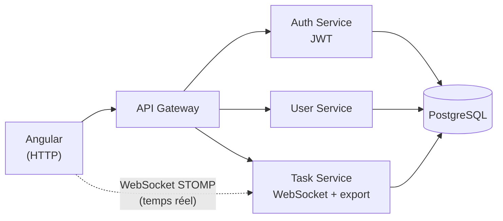

# TaskFlow

Calendrier de planification collaboratif : plusieurs admins et agents travaillent sur le même planning en même temps, et voient les changements des autres apparaître en direct.

Le vrai sujet du projet n'est pas le CRUD des tâches, mais tout ce qu'implique le fait que plusieurs personnes modifient les mêmes données en même temps : diffusion en temps réel via WebSocket, affichage de qui est connecté, et gestion des conflits quand deux personnes modifient la même tâche au même moment.

## Fonctionnalités

- Authentification par JWT (admin / agent)
- Calendrier interactif (FullCalendar) : création, modification, glisser-déposer des tâches
- Synchronisation en temps réel via WebSocket (STOMP) : les tâches créées/modifiées/supprimées par un utilisateur apparaissent instantanément chez les autres
- Indicateur de présence : affiche qui d'autre a le calendrier ouvert en ce moment
- Verrouillage optimiste (`@Version`) : empêche deux personnes d'écraser silencieusement la modification de l'autre sur la même tâche
- Export des tâches
- Application containerisée avec Docker Compose
- Pipeline CI (GitHub Actions) qui vérifie que le frontend et les 4 services compilent à chaque push

## Architecture

Le projet est découpé en microservices Spring Boot + un frontend Angular.



Chaque service Spring Boot a sa propre base de code et communique avec les autres via HTTP. Le `task-service` expose aussi un endpoint WebSocket directement (sans passer par le gateway) pour garder les connexions temps réel simples et fiables.

## Stack technique

**Frontend** : Angular 19, TypeScript, TailwindCSS, FullCalendar, RxJS, STOMP.js

**Backend** : Java 17, Spring Boot, Spring Cloud Gateway, Spring Security (JWT), Spring WebSocket, Spring Data JPA, PostgreSQL

**Infra** : Docker, Docker Compose, GitHub Actions

## Lancer le projet en local

### Avec Docker (le plus simple)

```bash
cd "planification des taches"
cp .env.example .env

docker compose up --build
```

L'API Gateway est disponible sur `http://localhost:8080`.

### Sans Docker

Il faut une instance PostgreSQL qui tourne en local, puis lancer chaque service :

```bash
cd planification des taches/authentification-service && ./mvnw spring-boot:run
cd planification des taches/user-service && ./mvnw spring-boot:run
cd planification des taches/task-service && ./mvnw spring-boot:run
cd planification des taches/api-gateway && ./mvnw spring-boot:run
cd AppFront && npm install && ng serve
```

Le frontend est disponible sur `http://localhost:4200`.

## Prochaines étapes

- Ajouter des tests unitaires et d'intégration (la CI vérifie pour l'instant seulement la compilation)
- Faire passer `task-service` derrière l'API Gateway avec un proxy WebSocket
- Ajouter des notifications (email ou push) sur les échéances proches
