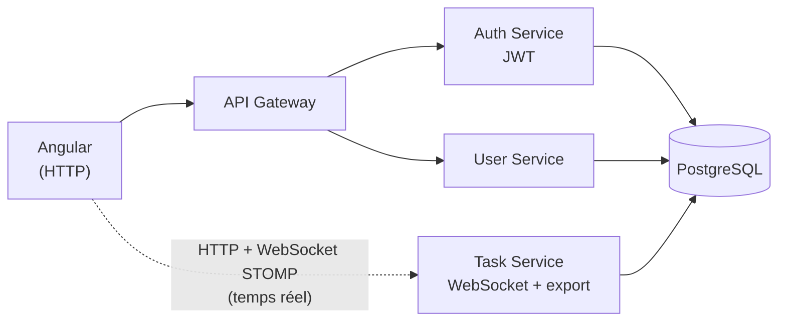

# TaskFlow

Calendrier de planification collaboratif : plusieurs admins et agents travaillent sur le même planning en même temps, et voient les changements des autres apparaître en direct.

Le vrai sujet du projet n'est pas le CRUD des tâches, mais tout ce qu'implique le fait que plusieurs personnes modifient les mêmes données en même temps : diffusion en temps réel via WebSocket, affichage de qui est connecté, et gestion des conflits quand deux personnes modifient la même tâche au même moment.

Le manager a aussi un tableau de bord qui repère les vrais problèmes de planning : qui est surchargé, quelles tâches prennent du retard, et quels agents ont des créneaux qui se chevauchent.

## Fonctionnalités

- Authentification par JWT (admin / agent)
- Calendrier interactif (FullCalendar) : création, modification, glisser-déposer des tâches
- Synchronisation en temps réel via WebSocket (STOMP) : les tâches créées/modifiées/supprimées par un utilisateur apparaissent instantanément chez les autres
- Indicateur de présence : affiche les utilisateurs connectés en temps réel
- Verrouillage optimiste (`@Version`) : empêche deux personnes d'écraser silencieusement la modification de l'autre sur la même tâche
- Tableau de bord manager : charge de travail par agent et tâches en retard, sous forme de graphiques
- Détection automatique des chevauchements de planning entre les tâches d'un même agent
- Export des tâches en Excel
- Application containerisée avec Docker Compose
- Pipeline CI (GitHub Actions) qui vérifie que le frontend et les 4 services compilent à chaque push

## Architecture

Le projet est découpé en microservices Spring Boot + un frontend Angular.



Chaque service Spring Boot a sa propre base de code et communique avec les autres via HTTP. Le `task-service` est appelé directement par le frontend, sans passer par le gateway, pour garder les connexions WebSocket simples et fiables.

## Stack technique

**Frontend** : Angular 19, TypeScript, TailwindCSS, FullCalendar, RxJS, STOMP.js

**Backend** : Java 17, Spring Boot, Spring Cloud Gateway, Spring Security (JWT), Spring WebSocket, Spring Data JPA, PostgreSQL

**Infra** : Docker, Docker Compose, GitHub Actions

## Lancer le projet en local

### Avec Docker (le plus simple)

`docker-compose.yml` ne lance que le backend (Postgres + les 4 services Java). Le frontend se lance à part.

```cmd
cd "planification des taches"
copy .env.example .env
:: editer .env avec un editeur de texte : mettre un vrai JWT_SECRET et un mot de passe DB

docker compose up --build
```

Puis, dans un autre terminal :

```cmd
cd AppFront
npm install
ng serve
```

Ouvrir `http://localhost:4200`.

### Sans Docker

Il faut une instance PostgreSQL qui tourne en local, puis lancer chaque service dans un terminal séparé (le dossier `planification des taches` contient des espaces, donc les guillemets sont nécessaires). Chaque service Java a besoin d'un `JWT_SECRET` défini dans l'environnement : ça doit être une clé Base64 d'au moins 32 octets, **identique pour les trois services** (`authentification-service`, `user-service`, `task-service`), sinon un token signé par l'un n'est pas validé par l'autre.

Pour générer une clé valide en PowerShell :

```powershell
$bytes = New-Object byte[] 32
(New-Object Security.Cryptography.RNGCryptoServiceProvider).GetBytes($bytes)
[Convert]::ToBase64String($bytes)
```

Ou reprendre directement cet exemple : `BqJPKRbUCJonLcQE/BahGxDNpr1C/+SnOuGuSeTSjM0=` (clé de démonstration uniquement, à ne jamais utiliser telle quelle en production)

Terminal 1 :
```cmd
cd "planification des taches\authentification-service"
set JWT_SECRET=BqJPKRbUCJonLcQE/BahGxDNpr1C/+SnOuGuSeTSjM0=
mvnw.cmd spring-boot:run
```

Terminal 2 :
```cmd
cd "planification des taches\user-service"
set JWT_SECRET=BqJPKRbUCJonLcQE/BahGxDNpr1C/+SnOuGuSeTSjM0=
mvnw.cmd spring-boot:run
```

Terminal 3 :
```cmd
cd "planification des taches\task-service"
set JWT_SECRET=BqJPKRbUCJonLcQE/BahGxDNpr1C/+SnOuGuSeTSjM0=
mvnw.cmd spring-boot:run
```

Terminal 4 :
```cmd
cd "planification des taches\api-gateway"
mvnw.cmd spring-boot:run
```

Terminal 5 :
```cmd
cd AppFront
npm install
ng serve
```

Le frontend est disponible sur `http://localhost:4200`.

### Se connecter

Un premier compte admin est créé automatiquement au démarrage du `user-service`, s'il n'y a encore aucun admin en base. Par défaut : `admin@demo.com` / `admin123`. On peut choisir un autre email/mot de passe avec les variables d'environnement `ADMIN_EMAIL` et `ADMIN_PASSWORD` avant de lancer le service.

Une fois connecté en tant qu'admin, les autres comptes (agents, autres admins) se créent depuis l'interface, page "Utilisateurs".

## Défis techniques

Deux problèmes de ceux rencontrés pendant le développement

**Un utilisateur ne voyait aucune présence sur le calendrier, ni la sienne ni celle des autres.** Intermittent, difficile à reproduire. En testant avec deux navigateurs en parallèle, j'ai remarqué que ça dépendait d'un timing : le serveur envoyait la liste complète des présents *avant* que le navigateur du nouvel arrivant ait fini de s'abonner au topic WebSocket correspondant, donc il ratait complètement ce message et n'avait plus aucune liste à afficher. Solution : découper la connexion en deux étapes (enregistrement, puis envoi de la liste seulement une fois l'abonnement réellement effectif côté serveur) au lieu de tout faire au moment du CONNECT.

**Une migration de base de données a échoué en ajoutant le verrouillage optimiste.** La colonne `version` devait être non nulle, mais la table `tache` avait déjà des lignes en production locale — Postgres refusait la migration. Solution : donner une valeur par défaut à la colonne (`default 0`) pour que les lignes existantes soient remplies automatiquement au lieu de bloquer.

## Prochaines étapes

- Ajouter des tests unitaires et d'intégration (la CI vérifie pour l'instant seulement la compilation)
- Faire passer `task-service` derrière l'API Gateway avec un proxy WebSocket
- Ajouter des notifications (email ou push) sur les échéances proches
